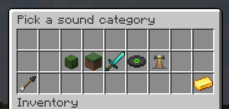
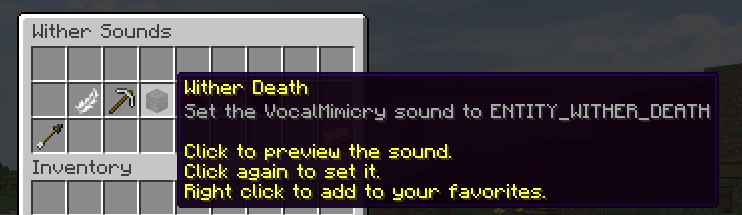

# Description
A menu for the VocalMimicry addon ([ProjectAddons](https://github.com/Simplicitee/ProjectAddons)) that allows you to easily select a sound to use

# Installation
1. Install ProjectAddons (to the plugins folder)
2. Install VocalMimicryMenu (also to the plugins folder)
3. Profit ???

# Usage
Use the `/vocalmenu` command or `/b vocalmenu` to bring up the menu

Click a sound to preview the sound, and click it again to set it as the sound to use. Sounds can be favorited by right clicking them where they can be accessed easily in the favorites menu.

# Permissions
- `bending.command.vocalmenu` - Default. Allows the user to use the menu.
- `bending.command.vocalmenu.favorite` - Default. Allows the user to favorite sounds.
- `bending.command.vocalmenu.favorite.<number>` - Allows the user to favorite that number of sounds. Defaults to 5.

# Images

